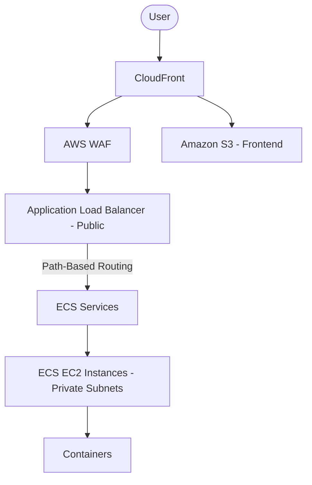
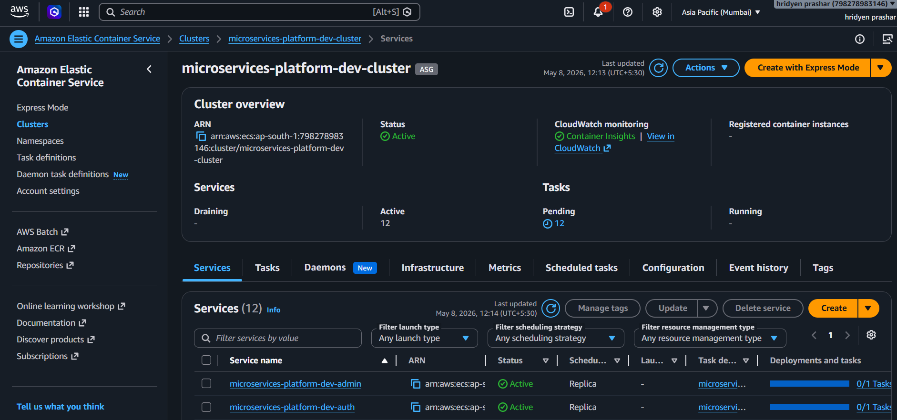
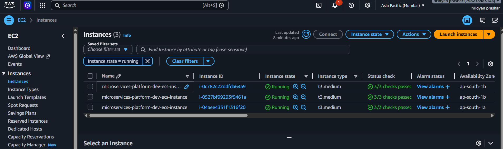
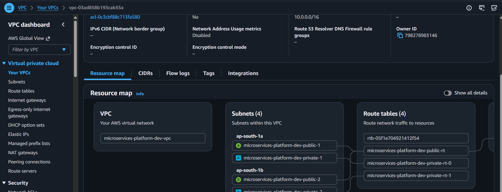
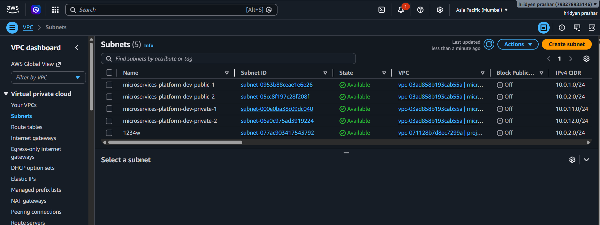
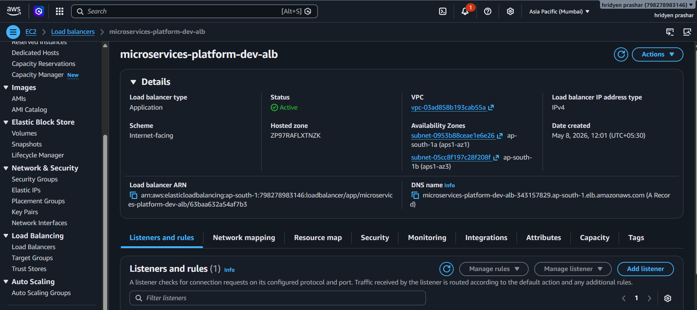
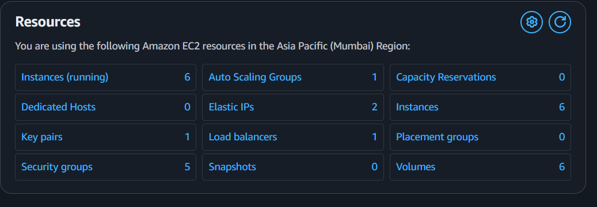

# Production-Grade AWS Microservices Platform using Terraform + ECS EC2

## Overview

This project demonstrates a production-style AWS microservices platform built using Terraform with a modular Infrastructure-as-Code architecture.

The platform is designed around:

* ECS using EC2 launch type (not Fargate)
* Public Application Load Balancer
* Private ECS workloads
* Path-based routing
* CloudFront + S3 frontend architecture
* WAF protection
* IAM role separation
* Auto Scaling Groups
* Reusable Terraform modules
* Multi-service container orchestration
* CloudWatch logging
* ECR repositories per service

This architecture was intentionally designed to resemble a real enterprise deployment pattern rather than a basic tutorial setup.

---

# Architecture

## High-Level Request Flow



---

# Core Technologies

| Category                | Technology                    |
| ----------------------- | ----------------------------- |
| IaC                     | Terraform                     |
| Container Orchestration | Amazon ECS                    |
| Compute                 | EC2                           |
| Container Registry      | Amazon ECR                    |
| Networking              | VPC, Subnets, Route Tables    |
| Load Balancing          | Application Load Balancer     |
| CDN                     | CloudFront                    |
| Object Storage          | Amazon S3                     |
| Security                | AWS WAF, Security Groups      |
| Logging                 | CloudWatch                    |
| Scaling                 | Auto Scaling Group            |
| IAM                     | IAM Roles & Instance Profiles |

---

# Infrastructure Design Decisions

## Why ECS EC2 Instead of Fargate

The project intentionally uses ECS with EC2 launch type because:

* Better infrastructure ownership
* Lower cost at scale
* More OS-level control
* Easier daemon/service management
* Better simulation of enterprise workloads
* Custom AMI support
* Greater scheduling flexibility





---

# Networking Architecture

## VPC

```text
10.0.0.0/16
```


## Public Subnets

Used for:

* Application Load Balancer
* Internet Gateway routing

Example:

```text
10.0.1.0/24
10.0.2.0/24
```

## Private Subnets

Used for:

* ECS EC2 instances
* Containers
* Internal workloads

Example:

```text
10.0.11.0/24
10.0.12.0/24
```


---

# Security Design

## ALB Security Group

Allowed:

* HTTP (80)
* HTTPS (443)

Inbound from:

```text
0.0.0.0/0
```

## ECS Security Group

Allowed only from:

* ALB Security Group

No public inbound traffic allowed.


---

# Microservices Architecture

The infrastructure supports multiple independent microservices.

## Example Services

* auth
* user
* payment
* order
* inventory
* product
* review
* search
* notification
* gateway
* cart
* admin

Each service contains:

* ECS Task Definition
* ECS Service
* Dedicated Target Group
* ALB Listener Rule
* CloudWatch Log Group
* ECR Repository

---

# Path-Based Routing

ALB routes traffic using path-based rules.

## Example Routes

```text
/api/auth/*      → auth-service
/api/user/*      → user-service
/api/order/*     → order-service
/api/payment/*   → payment-service
```

This design allows multiple backend services to share a single ALB.




---

# CloudFront + S3 Integration

Frontend architecture:

```text
User → CloudFront → S3
```

API architecture:

```text
User → CloudFront → ALB → ECS
```

Benefits:

* Lower latency
* Edge caching
* Better scalability
* DDoS protection
* Improved performance


---

# WAF Protection

AWS WAF was attached to the ALB.

## Enabled Managed Rules

* AWSManagedRulesCommonRuleSet
* SQL Injection protection
* Rate limiting
* Common exploit mitigation

---

# Auto Scaling Strategy

The ECS infrastructure uses:

* Launch Templates
* Auto Scaling Groups
* ECS Capacity Providers

## Initial Capacity

```text
Desired Capacity: 3 EC2
Minimum Capacity: 2 EC2
Maximum Capacity: 6 EC2
```

This allows containers to distribute automatically across instances.


---

# Terraform Repository Structure

```text
terraform-aws-microservices/
│
├── bootstrap/
│   ├── s3-backend/
│   └── dynamodb-lock/
│
├── modules/
│   ├── alb/
│   ├── cloudfront/
│   ├── cloudwatch/
│   ├── ecr/
│   ├── ecs-cluster/
│   ├── ecs-service/
│   ├── iam/
│   ├── s3-static-site/
│   ├── security-groups/
│   ├── vpc/
│   └── waf/
│
├── environments/
│   └── dev/
│       ├── main.tf
│       ├── variables.tf
│       ├── outputs.tf
│       ├── provider.tf
│       ├── backend.tf
│       └── terraform.tfvars
│
└── README.md
```


---

# Terraform Workflow

## Initialization

```bash
terraform init
```

## Validation

```bash
terraform validate
```

## Execution Plan

```bash
terraform plan
```

## Deployment

```bash
terraform apply
```


---

# Region Used

AWS Region:

```text
ap-south-1
```

This deploys infrastructure into:

* Mumbai Region
* Asia Pacific (Mumbai)

---

# Infrastructure Created

## Networking

* VPC
* Public Subnets
* Private Subnets
* Internet Gateway
* Route Tables
* Route Table Associations

## Security

* ALB Security Group
* ECS Security Group
* AWS WAF

## Compute

* ECS Cluster
* ECS Services
* ECS Task Definitions
* Launch Template
* Auto Scaling Group
* EC2 Instances

## Load Balancing

* Application Load Balancer
* Listener Rules
* Target Groups

## Storage & CDN

* S3 Static Website Bucket
* CloudFront Distribution

## Monitoring

* CloudWatch Log Groups





## Registry

* Multiple ECR Repositories

## IAM

* ECS Instance Role
* ECS Task Execution Role
* ECS Task Role
* IAM Instance Profile

---

# Major Errors Encountered and Fixes

## 1. Terraform Initialized in Empty Directory

### Error

```text
Terraform initialized in an empty directory
```

### Root Cause

Terraform was executed from the wrong directory.

### Fix

Moved into:

```bash
cd environments/dev
```

---

## 2. Invalid Single-Argument Block Definition

### Error

```text
Invalid single-argument block definition
```

### Root Cause

Terraform variables were written in unsupported single-line multi-attribute format.

### Incorrect Syntax

```hcl
variable "instance_type" { type = string, default = "t3.medium" }
```

### Correct Syntax

```hcl
variable "instance_type" {
  type    = string
  default = "t3.medium"
}
```

---

## 3. Unsupported Arguments in Modules

### Error

```text
Unsupported argument
```

### Root Cause

Module input names in `main.tf` did not match module variable definitions.

### Example

Incorrect:

```hcl
name = local.name
```

Correct:

```hcl
project_name = local.name
```

---

## 4. Missing Required Arguments

### Error

```text
Missing required argument
```

### Root Cause

Required variables were not passed into modules.

### Fix

Added:

```hcl
service_names
instance_profile_name
```

into module blocks.

---

## 5. Undeclared Input Variables

### Error

```text
Reference to undeclared input variable
```

### Root Cause

Variable names inside module logic still referenced older variable names.

### Example

Incorrect:

```hcl
var.private_subnet_ids
```

Correct:

```hcl
var.private_subnets
```

---

## 6. ALB Target Group Name Validation Error

### Error

```text
name cannot end with a hyphen
```

### Root Cause

AWS target group names were truncated to 32 characters and ended with `-`.

### Fix

Used:

```hcl
replace(substr(name, 0, 32), "/-$/", "")
```

---

## 7. No Matching Service Route

### Error

```text
No matching service route
```

### Root Cause

ALB path rules did not match `/` root path.

### Fix

Accessed routes using:

```text
/api/auth/
/api/user/
/api/order/
```

instead of:

```text
/
```

---

## 8. 503 Service Temporarily Unavailable

### Root Cause

ALB matched routes successfully but target groups had no healthy targets.

### Causes Investigated

* ECS tasks not healthy
* Health check endpoint failure
* Missing `/health` route
* ECS service startup delays

### Health Check Path

```text
/health
```

---

# Validation Results

Terraform successfully generated infrastructure plans including:

* ECS Cluster
* Auto Scaling Group
* Multiple Target Groups
* Security Groups
* VPC Networking
* WAF
* CloudFront
* IAM Roles
* CloudWatch Logs
* ECR Repositories

Total resources planned:

```text
80+ AWS resources
```

---

# Scalability Design

This architecture supports:

* Horizontal scaling
* Independent service deployments
* Container distribution
* Centralized load balancing
* Reusable module expansion
* Environment isolation

---

# Future Improvements

Potential enterprise-grade enhancements:

* CI/CD pipelines
* GitHub Actions
* Blue/Green deployments
* Route53 custom domains
* ACM certificates
* ECS Service Discovery
* VPC Endpoints
* Prometheus + Grafana
* OpenSearch
* Secrets Manager
* Private internal ALBs
* Canary deployments

---

# Learning Outcomes

This project helped demonstrate practical understanding of:

* Terraform module architecture
* AWS networking fundamentals
* ECS deployment patterns
* Load balancing concepts
* IAM design
* Auto Scaling
* Infrastructure debugging
* Terraform validation workflows
* Cloud-native architecture
* Production-style infrastructure design

---

# Conclusion

This project represents a production-oriented Terraform implementation for AWS microservices infrastructure.

The architecture focuses on:

* Scalability
* Security
* Modularity
* Reusability
* Enterprise deployment patterns

The infrastructure was intentionally built using reusable Terraform modules and ECS on EC2 to simulate real-world deployment environments commonly used in production systems.
